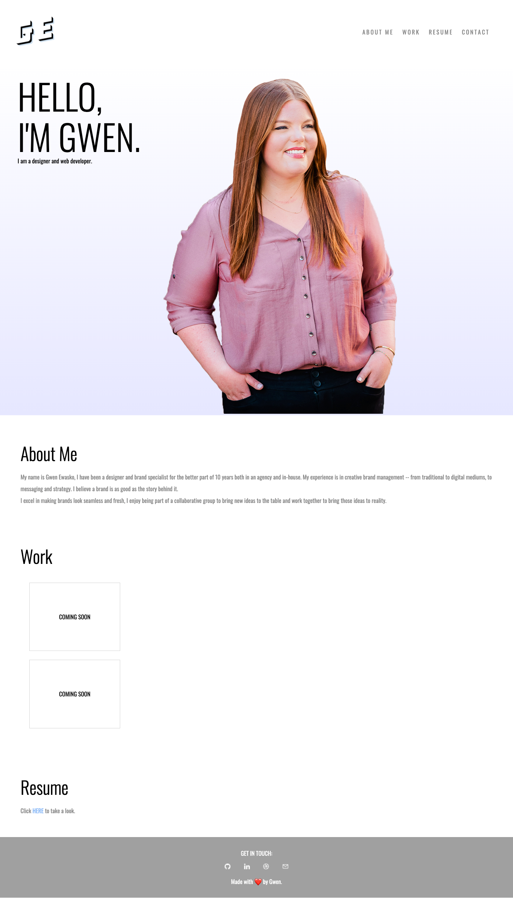

# 02 Advanced CSS: Portfolio

## Description

Please see my portfolio website below. It includes a nav, a header with image, my name and about me section, a work display section, a link to my resume and contact links in my footer.

It is responsive, and all my nav items link to thier correlating sections on the page.

## Screenshot

## Links to Application

- Here is the repo: [gwenewasko/repo](https://github.com/gwenewasko/portfolio)
- Here is the page: [gwenewasko/pages](https://gwenewasko.github.io/portfolio/)
